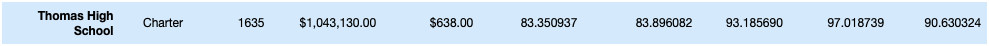

# School_District_Analysis

## Overview

our project is to help a chief data scientist analyzing school district standardized testing data from a variety of sources for city school system. The given data sources   contain all student math and reading scores, the schools they attend and much more additional information such as their grade, the type of schools, total students per school, and their school spending budget. Analyzing the data could help gain insights on school performance trends which could help make decisions regarding the school budgets and priorities.
 
For this analysis we will be using Jupyter Notebook with Python, Pandas Library and Numpy Library. Specifically, we are asked to analyze and collect the following list of information:

- a district summary to deliver a high-level snapshot of the district's key metrics inlucding
    - Total number of students
    - Total number of schools
    - Total budget
    - Average math score
    - Average reading score
    - Percentage of students who passed math
    - Percentage of students who passed reading
    - Overall passing percentage

- a summary snapshot of key metrics for each school in the district showing
  - School name
  - School type
  - Total students
  - Total school budget
  - Per student budget
  - Average math score
  - Average reading score
  - % passing math
  - % passing reading
  - % overall passing

- From there, we are tasked in finding the below set of information
  -Top 5 performing schools, based on the overall passing rate
  - The average math score received by students in each grade level at each school
  - The average reading score received by students in each grade level at each school
  - School performance based on the budget per student
  - School performance based on the school size 
  - School performance based on the type of school

- Additionally, it has been identified that reading and math grades for Thomas High School ninth graders appear to have been altered. In order to find the extend of this academic dishonesty, we will replace the math and reading scores for Thomas High School nienth graders with NaNs (null values) while keeping the rest of the data intact and perform the same distric and school analysis. 
  - Our end task is to construct new district and school summary datas to compare with original summary datas, and analyze how these changes affected the overall analysis.

## Resources

- Data Sources:
schools_complete.csv
students_complete.csv
- Software:
Pyton 3.7.11
Jupyter Notebook 6.4.6
Anaconda 4.11.0

## Results

### District Summary

**District Summary - Original**

**District Summary - Final**

### How is the district summary affected?

Replacing all Thomas High School ninth grades with a null value on the math and reading scores had a minimal impact on the district analysis. For the average scores, percentaging passing and overall percentage passing, all were only affected by less than 0.3% . Particularly,if the results are rounded to a whole number the summary results would be exactly the same. One of the main reason for the minimal impact is because there are only 461 ninth graders at Thomas High School whose scores were removed from the total calculation, where there are total 39,170 number of students. In other words, we have only removed roughly 1% of the student scores (or 461 counts) from the total calculation (or 39170 counts), which indeed would have a relatively minimal impact.

### School Summary

**School Summary - Original**

**School Summary - Final**

### How is the school summary affected?
The updated school summary only included passing scores AND the student totals from Thomas High School 10th to 12th graders. It excluded completely the 9th graders scores and their student counts from the calculation. 
The updated school summary impacted some of the key matrics on Thomas High School only, and not on the other schools. 
The changes for Thomas High School are on the percentage of students that passed either math and reading (% Passing Math and % Passing Reading), and those that passed both (% Overall Passing).

**Original Thomas High School Summary**

**Final Thomas High School Summary**

 - percentage passing math decreased from 93.27% to 93.19%
 - percentage passing reading decreased from 97.31 to 97.02% 
 - percentage overall passing decreased from 90.95% to 90.63%

Excluding Thomas High School nineth graders' scores and student counts did not impact greatly their school overal performance. This is because our new calculation "assumes" that the total number of students in Thomas High School are equal to the total number of 10th to 12th graders from Thomas High School. In other words, we were assuming that there are no ninth graders in Thomas High School for our calculation purpose.

In fact, if we are to include Thomas High School 9th grade students in the calcuation while none of those students have a valid test score, the school summary for Thomas High School would have a significant impact.

**Thomas High Summary including 9th Graders**

**Thomas High Summary with only 10th to 12th Graders (excluding 9th Graders)**

### How does replacing the ninth graders’ math and reading scores affect Thomas High School’s performance relative to the other schools?
Referring back to our final school summary result where Thomas High School ninth graders' student totals and scores were all excluded from the calculation, the school performance was only minimally affected.
Below shows the top 5 schools from original analysis and the final analysis. Thomas High School is the second top school rated by overall passing performance on both results.

**Top Firve Schools - Original**

**Top Five Schools - Final**

However, as mentioned above, if we are to include the number of students from Thomas High School ninth graders in the calculation, their relative rating would change significantly. In this situation, their overall percentage passing would drop to 65.08 % which would get the school removed from the top five rankings and brought down to mid spot of total ranking.

### How does replacing the ninth-grade scores affect the following:

### Math and reading scores by grade

The new data would simply replace Thomas High School-9th graders' reading and math scores to NaN, which represents a null value.

**Math Scores by Grade - Original**

**Math Scores by Grade - Final**

**Reading Scores by Grade - Original**

**Reading Score by Grade - Final**

### Scores by school spending

Thomas High School falls into the $630-644 spending ranges (per student), and therefore replacing the ninth-grade scores from the school would only have an impact on values within this spending range. However the impact are found to be very minimal which only changed by roughly 0.1% or less. 

**Scores by School Spending (with all decimals)- Original**

**Scores by School Spending (with all decimals)- Final**

If we round the end summary results to whole number, it shows no changes at all.

**Scores by School Spending - Original**

**Scores by School Spending - Final**

### Scores by school size

Thomas High School falls into the medium school size range, and therefore replacing the ninth-grade scores from the school would only have an impact on values within this size range. Similar to spending summary, the impacts are found to be very minimal and only changed the end values by roughly 0.1% or less. 

**Scores by School Size (with all decimals)- Original**

**Scores by School Size (with all decimals)- Final**

Liekly, if we round the end summary results to whole number, it shows no changes between the two.

**Scores by School Size - Original**

**Scores by School Size - Final**

### Scores by school type

Thomas High School is a chartered school and would only impact values that are under the chartered school types. Again, the impacts are found to be very minimal that only affected the end values by less than 0.1%.

**Scores by School Type (with all decimals)- Original**

**Scores by School Type (with all decimals)- Final**

Same as the results above, the scores by school type would show no change if round all values to whole number

**Scores by School Type - Original**

**Scores by School Type- Final**

## Summary

In summary, below are the changes in the updated school district analysis after reading and math scores for the ninth grade at Thomas High School have been replaced with NaNs.

1. District Summary
- minimal impact seen for following key matrics
    - Average math score changed from 79.0 to 78.9
    - Average reading score remained the same
    - % Passing math changed from 75 to 74.8
    - % Passing reading changed from 86 to 85.7%
    - % Overall passing changed from 65 to 64.9
- no change on total school numbers and total student numbers. We would still include all schools and all students in our district summary, and we only excluded Thomas High School ninth graders' scores and counts when we perform the calculations.

2. School Summary
- minimal impact on Thomas High School values, and not the other schools. 
    - percentage passing math decreased from 93.27% to 93.19%
    - percentage passing reading decreased from 97.31 to 97.02% 
    - percentage overall passing decreased from 90.95% to 90.63%

3. Top School Ranking
- No impact on school ranking based on overall percentage passing. 
- Thomas High School still remained as the second top schools.

4. Math and Reading Scores by Grade 
- Thomas High School-9th graders' reading and math scores replaced to NaN, which represents a null value.

5. Scores by school spending
- very minimal changes on score values. There is no change if round up the values to a whole number

6. Scores by School Size 
- very minimal changes on score values. There is no change if round up the values to a whole number

7. Scores by School Type
- very minimal changes on score values. There is no change if round up the values to a whole number
